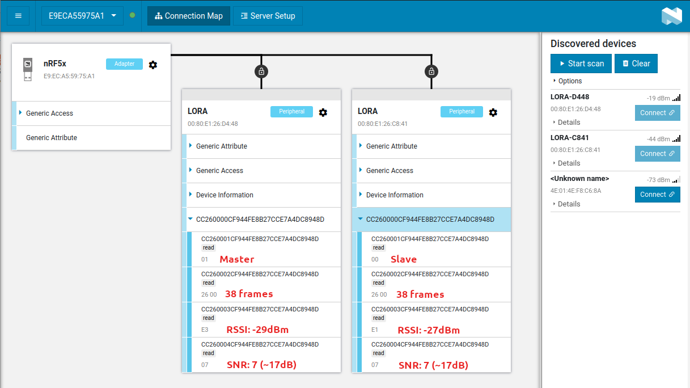
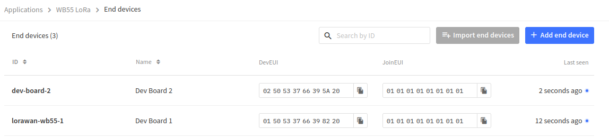
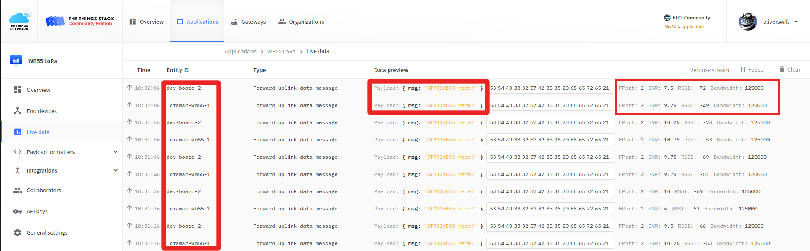
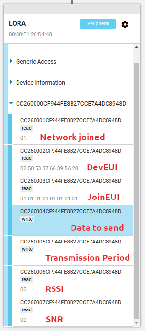

Technical achievements
======================

This section aims at describing all steps to achieve a complete IoT project. This can help in understanding to modify projet for own purpose (maybe contributions).

.. _I-CUBE-LRWAN: https://www.st.com/en/embedded-software/i-cube-lrwan.html

LoRa physical layer integration
-------------------------------

That was the very first step.  Making things work and I chose the low level RF transmission example for that (Ping Pong SubGhzPhy example application).
Porting the ST/Semtech code was a matter of dealing with reconfiguring the WB55 to:

- match the shield PIN out (DIOx and SPI)
- properly set clocks
- setup the RTC
- deal with IRQs

Pin mapping between the `Nucleo WB55 board`_ and the SX1272MB2DAS_ shield:

.. _Nucleo WB55 board: https://os.mbed.com/platforms/ST-Nucleo-WB55RG/
.. _SX1272MB2DAS: https://www.mouser.fr/images/marketingid/2017/microsites/185566741/Semtech_SX1272MB2DAS_Pinout.jpg

+--------------+--------------------+----------------------------+
| SX1272MB2DAS | P-NUCLEO-STM32WB55 | Arduino connector pin name |
+==============+====================+============================+
| DIO0         | PC6                | D2                         |
+--------------+--------------------+----------------------------+
| DIO1         |PA10                | D3                         |
+--------------+--------------------+----------------------------+
| DIO2         |PC10                | D4                         |
+--------------+--------------------+----------------------------+
| DIO3         |PA15                | D5                         |
+--------------+--------------------+----------------------------+
| NSS          |PA4                 | D10                        |
+--------------+--------------------+----------------------------+
| SCLK         |PA5                 | D13                        |
+--------------+--------------------+----------------------------+
| MISO         |PA6                 | D12                        |
+--------------+--------------------+----------------------------+
| MOSI         |PA7                 | D11                        |
+--------------+--------------------+----------------------------+
| RESET        |PC0                 | A0                         |
+--------------+--------------------+----------------------------+

So nothing incompatible at first look. SPI1 pin set matches, NSS and Reset pins are ok too. But here comes the first hickup with the IRQ lines.
PC6 uses the EXTI6 IRQ line (EXTI9_5_IRQn), that's fine, but PA10,PC10 and PA15 share the same EXTI IRQ line, that is EXTI15_10_IRQn.

So the radio interface definition has been modified to match the Nucleo-WB55 board (**sx1272mb2das_conf.h**). And the IRQ handlers have been modified to check GPIO (DIOx) states prior to calling corresponding SX1272 IRQ handlers (check out **stm32wbxx_it.c** source file)

RTC has clock source set to LSE.

Original project file layout has also been slightly modified. The integration of the original files has been made on a MX generated project (**sx1272.ioc**) to preserve possibility to change the project. However, it should be precautiously done as *conflicting code* maybe generated.

Programming two boards with this code works, and as expected the first board that receives a PONG response to a PING message becomes *master* the other becomes *slave*. I made the LED status reflect this (as formerly planned in the original code). One is blinking red where the other has the green LED blinking after a short time: VIDEO_.

.. _VIDEO: https://debon.org/SX1272/sx1272_ping_pong.mp4

BLE stack integration
---------------------

The BLE code is a completely MX generated one. Having one that works right away wasn't straightforward as many things have to be properly set in the MX project (that could be a seperate article). I setup a BLE test project seperately for that purpose, once it worked I merged the code into the LoRa project to make the two run side by side.

So the BLE test software is just a HRS (Heart Rate Sensor) peripheral code. It is based on a completely different timer framework which is called Hardware Timer Server (HW_TS). The Semtech LoRa library is not based on this one but on a stm32_timer utility, itself based on the HAL RTC driver. I removed the  utility library and RTC adapter so the entire project relies on HW_TS only. The LoRa library actually relies on an intermediate API (timer.h) which was easy to rewrite so HW_TS is used instead. The Ping Pong application on the other hand relies on the former utility library. A few changes made on that part made the whole code rely on HW_TS only.

I needed to merge the TaskIds defined by Ping Pong application and the BLE code. Fortunately the two use the **stm32_sequencer** utility. Once properly done I successfully made the LoRa Ping Pong application **and** a HRS BLE application running concurrently and flawlessly on the STM32WB55 board.

I modified the *app_ble.c* code so the advertized (visible) name is based on STM32 UDN so we can distinguish boards running at the same time.

For a useful demo, I wrote a dedicated GATT service so both boards could be interrogated via BLE so you can know which role the LoRa node has (master or slave) and number of PING/PONG sent/received. For this I slightly adapted the BLE code so Blue LED reflects BLE connection state. The custom service (not generated by MX, it's too messy), has two characteristics, one to know node role (master or slave after PingPong synchronization) and another one that is a counter of the received PING frames (slave node) or PONG frames (master node). Here is the screenshot of NRF Connect connected to the two synchronized boards:

LoRaWAN stack integration
-------------------------

The LoRaWAN stack is the one by Semtech provided in the I-CUBE-LRWAN_ expansion package.
It is 1.0.3 compliant and includes certification software package if LoRa Alliance certfication is needed for the final device.

Again, the code relies on a different RTC wrapper than the BLE stack, so it has been been modified for that. The number of timers has been increased because initial HW TimerServer setting is too limited for running the two stacks concurrently (**hw_if.h** file changed after modified ioc).

The original example, LoRaWAN End Node, sends a very complete set of data, where I drastically reduced the test frame to a simple text string.

The device is set to Join the network using OTAA, so 3 elements are needed: DevEUI, JoinEUI and APPKey. DevEUI is a unique identifier for a hardware device and is built from STM32 "serial number". The JoinEUI (or former AppEUI) identifier is used for application separation on server side. The APPKey is very important (a AES128 key) that muts be kept very secretly. The source code arbitrary set it to a value that must be changed for final use. Secrecy is done by Semtech code using a Secure Element API, in our case it's a virtual SE but this very convenient if you happen to use an actual one.

JoinEUI and AppKEY are hardcoded in *se-identity.h* file (*LORAWAN_APP_KEY* and *LORAWAN_NWK_KEY* **must** be same values for OTAA, the latter is used to compute the MIC and is necessary for the JoinRequest to be valid on LNS).

Testing with TTN and TTIG gateway gives these:

For the declarative part.

Once the two boards had a positive reply from their respective JoinRequest.

A special GATT service has been written to expose:

+-----------+--------+-----------------------------------------------------------------------+
| Attribute | Access | Comment                                                               |
+===========+========+=======================================================================+
| Status    | Read   | Whether or not the JoinRequest has completed                          |
+-----------+--------+-----------------------------------------------------------------------+
| DevEUI    | Read   | Readout of computed DevEUI                                            |
+-----------+--------+-----------------------------------------------------------------------+
| JoinEUI   | Read   | Readout of hardcoded JoinEUI/AppEUI                                   |
+-----------+--------+-----------------------------------------------------------------------+
| Data      | Write  | Data that will be sent (16 bytes max.). Defaults to "STM32WB55 here!" |
+-----------+--------+-----------------------------------------------------------------------+
| Period    | Write  | Period in seconds at which data are sent (defaults to 10 seconds)     |
+-----------+--------+-----------------------------------------------------------------------+
| RSSI      | Read   | Updated when downlink message is received                             |
+-----------+--------+-----------------------------------------------------------------------+
| SNR       | Read   | Updated when downlink message is received                             |
+-----------+--------+-----------------------------------------------------------------------+

.. note:: Don't mess with period, there is a duty cycle limitation of 1%.
          With the default settings, the module sends 15 bytes every 10 seconds. At SF7BW125 this can be
          done at the lowest period of ~7 secs.

Here an illustration of the exposed characteristics when connected to it:

Low Power Management
--------------------

**to be continued**

