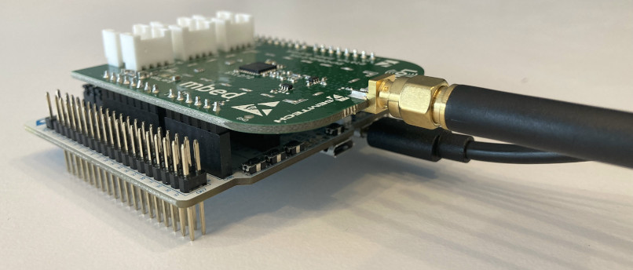
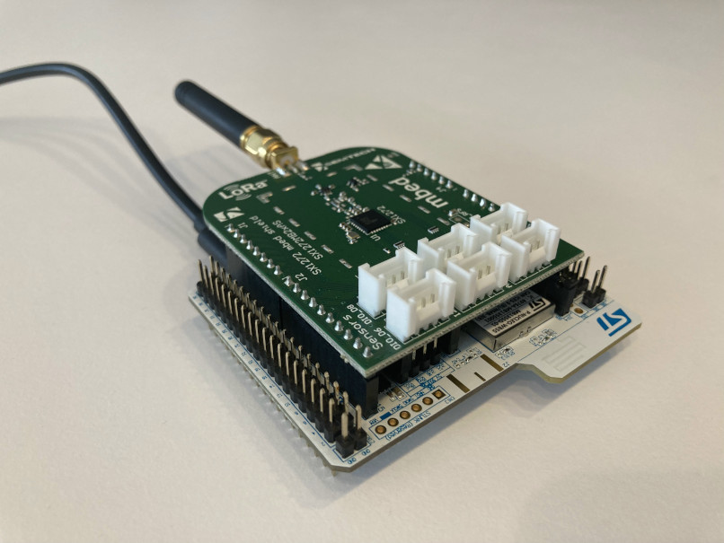

Hardware
========

Semtech
-------

That's an easy one to come by. The `Semtech SX1272MB2xAS LoRa Mbed shield`_ is arduino compatible shield and Nucleo boards have the corresponding connector.
Technical brief:

- SX1272 Low Power Long Range Transceiver
- 868MHz to 915MHz
- 14dBm output
- LoRa modulation as well as FSK/OOK

.. _Semtech SX1272MB2xAS LoRa Mbed shield: https://www.mouser.fr/new/semtech/semtech-sx1272-mbed-shield/

STMicroelectronics
------------------

As mentioned the STM32WB55 serie is the target here and the P-Nucleo-WB55RG_  is a nice board to play with.
Technical brief:

- STM32 family with M4+M0 cores (dual core)
- 2.4GHz capable with 802.15.4, BLE4/5, ZigBee, OpenThread protocol stack firmware
- On-board ST-LINK
- USB connectors, 3 LEDs, buttons
- Battery socket

.. _P-Nucleo-WB55RG: https://www.st.com/en/evaluation-tools/p-nucleo-wb55.html

The combo
---------
Once hooked up (it's a no brainer) here is the resulting object.

Never forget to plug the antenna prior to powering up the boards. You may damage the RF amplifier output (although it's a rather low power one).
Of course, buying two of each is a bit necessary for Ping Pong.
