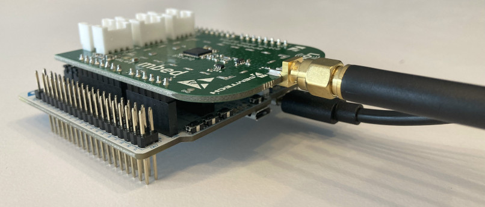
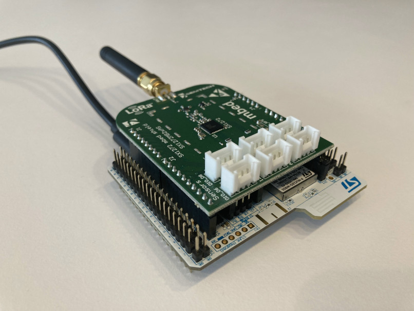

# LoRa Shield and STM32WB55

- Project status: **Ping Pong SubGhzPhy application works.**
- Next step: add BLE stack.

## Goal
The main idea is to be able to use Semtech LoRa SX1272 shield on a STM32WB55 Nucleo board. Unfortunately code available by ST ([I-CUBE-LRWAN](https://www.st.com/en/embedded-software/i-cube-lrwan.html)) for this shield is only available for a few Nucleo boards (L053RG, L073RZ, L152RE and L476RG).

The derivative ideas are to marry LoRa and BLE, nowadays many IoT objects are BLE accessible for various reasons (settings, provisonning, FUOTA, ...) but mostly because it is compatible with smartphones. The STM32WL serie has no BLE and the STM32WB serie has no LoRa capabilities.

Well, I had the opportunity to create a pair with SX1272 and WB55 and allow a two chip combination for flexible IoT project. Keep in mind that the WB55 serie is not limited to BLE. The coprocessor firmware can handle 2.4GHz sideway protocols like ZeeBee and OpenThread. So the combination of long range and short range RF communications is interesting.

This project is only a port of existing codes and libraries but might save setup time for some developers as there are some technical issues to solve.

## Hardware
### Semtech
That's an easy one to come by. The [Semtech SX1272 LoRa Mbed shield](https://www.mouser.fr/new/semtech/semtech-sx1272-mbed-shield/) is arduino compatiebl shield and Nucleo boards have the corresponding connector.
### STMicro
As mentioned the STM32WB55 serie is the target here and the [P-Nucleo-WB55RG](https://www.st.com/en/evaluation-tools/p-nucleo-wb55.html)  is a nice board to play with.
### The combo
Once hooked up (it's a no brainer) here is the resulting object.
  
Never forget to plug the antenna prior to powering up the boards. You may damage the RF amplifier output (although it's a rather low power one).
Of course, buying two of each is a bit necessary.

## Software
### Development requirements
My favorite development environment is Linux but ST tools are available for Mac and Windows as well. The first two are easier to setup, usually no issues or driver problems. Well, hardnuts know that already.
Although I'm not a great fan of IDEs, STM32CudeIDE works ok and ST plugins helped (MX, Software expansions download,...).
STMicro provides a software expansion package for some LoRa shields. As linked above it's the I-CUBE-LRWAN and contains example projects and libraries like low level SX1273 drivers (through the SPI) and the LoRaWAN stack (1.0.3 compatible).
