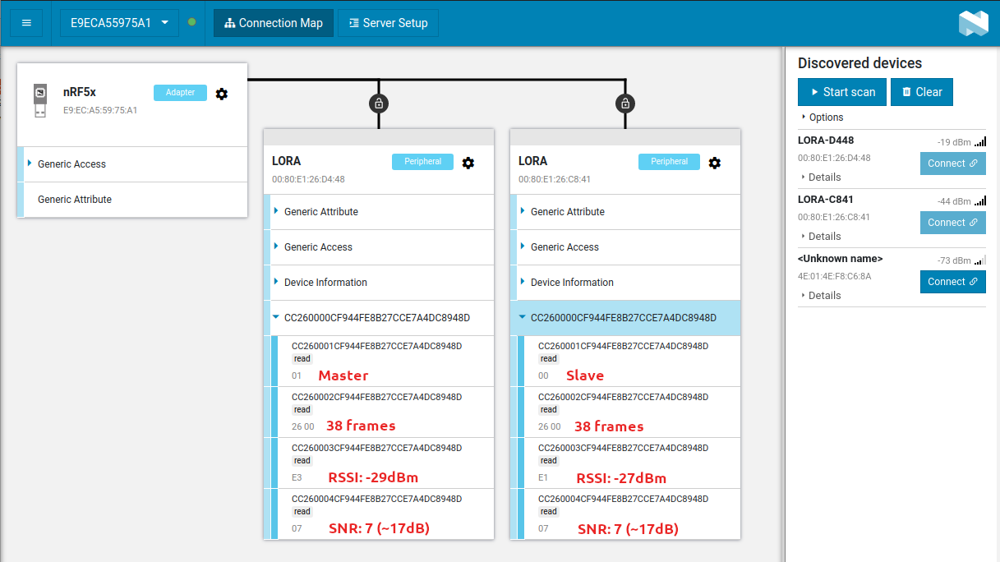

***WIP***

# LoRa SX1272 Shield and STM32WB55

***Project status:***
- [x] **Ping Pong SubGhzPhy application**
- [x] add BLE stack along with LoRa Ping Pong
- [ ] Master/slave LoRa/BLE application
- [x] LoRaWAN example
- [ ] LPM management

## Goal
The main idea is to be able to use Semtech LoRa SX1272MB2DAS shield on a STM32WB55 Nucleo board. Unfortunately code available by ST ([I-CUBE-LRWAN](https://www.st.com/en/embedded-software/i-cube-lrwan.html)) for this shield is only available for a few Nucleo boards (L053RG, L073RZ, L152RE and L476RG).

The derivative ideas are to marry LoRa and BLE, nowadays many IoT objects are BLE accessible for various reasons (settings, provisonning, FUOTA, ...) but mostly because it is compatible with smartphones. The STM32WL serie has no BLE and the STM32WB serie has no LoRa capabilities.

Well, I had the opportunity to create a pair with SX1272 and WB55 and allow a two chip combination for flexible IoT project. Keep in mind that the WB55 serie is not limited to BLE. The coprocessor firmware can handle 2.4GHz sideway protocols like ZigBee and OpenThread. So the combination of long range and short range RF communications is interesting.

This project is only a port of existing codes and libraries but might save setup time for some developers as there are some technical issues to solve.

With upcoming LoRa 2.4GHz this is to be considered as transitional work. The SX1280 will combine short and long range communication in a single chip. You might want to take a [closer look](https://www.semtech.com/products/wireless-rf/lora-24ghz).

## Hardware
### Semtech
That's an easy one to come by. The [Semtech SX1272MB2xAS LoRa Mbed shield](https://www.mouser.fr/new/semtech/semtech-sx1272-mbed-shield/) is arduino compatible shield and Nucleo boards have the corresponding connector.
Technical brief:
- SX1272 Low Power Long Range Transceiver
- 868MHz to 915MHz
- 14dBm output
- LoRa modulation as well as FSK/OOK

### STMicro
As mentioned the STM32WB55 serie is the target here and the [P-Nucleo-WB55RG](https://www.st.com/en/evaluation-tools/p-nucleo-wb55.html)  is a nice board to play with.
Technical brief:
- STM32 family with M4+M0 cores (dual core)
- 2.4GHz capable with 802.15.4, BLE4/5, ZigBee, OpenThread protocol stack firmware
- On-board ST-LINK
- USB connectors, 3 LEDs, buttons
- Battery socket

### The combo
Once hooked up (it's a no brainer) here is the resulting object.
  

Never forget to plug the antenna prior to powering up the boards. You may damage the RF amplifier output (although it's a rather low power one).
Of course, buying two of each is a bit necessary for Ping Pong.

## Software
### Licenses
Major part of the code are covered by ST and Semtech sublicensing. Check out respective agreements for proper use:

Component | Copyright | License
----------|-----------|--------
Original application source | STMicroelectronic | [ST License agreement SLA0044](https://www.st.com/content/ccc/resource/legal/legal_agreement/license_agreement/group0/39/50/32/6c/e0/a8/45/2d/DM00218346/files/DM00218346.pdf/jcr:content/translations/en.DM00218346.pdf)
LoRaWAN® stacks | Semtech | [BSD Revised Licensed for Semtech parts](https://opensource.org/licenses/BSD-3-Clause)
Cortex®-M CMSIS | ARM Ltd | [BSD-3-Clause](https://opensource.org/licenses/BSD-3-Clause) or [Apache License 2](https://opensource.org/licenses/Apache-2.0)

### Development requirements
My favorite development environment is Linux but ST tools are available for Mac and Windows as well. The first two are easier to setup, usually no issues or driver problems. Well, real tech savvy's know that already.

Although I'm not a great fan of IDEs, STM32CudeIDE works ok and ST plugins helped (MX, Software expansions download,...).
STMicro provides a software expansion package for some LoRa shields. As linked above it's the I-CUBE-LRWAN and contains example projects and libraries like low level SX1272 drivers (through the SPI) and the LoRaWAN stack (1.0.3 compatible).

The project can easily be open in STM32CudeIDE without dependencies. All code is there no need to install WB or LoRaWAN firmare from ST. Open  the project and build it (tested on Linux and MacOS). Of course, you'll need the BLE Stack firmware installed for CPU2. Here, _stm32wb5x_BLE_Stack_full_fw.bin_ has been flashed. Every stacks firmware are provided in _Projects/STM32WB_Copro_Wireless_Binaries/STM32WB5x_ directories of STM32CubeWB firmware package as well as how to program the boards for this. It needs to be done once.

The whole experiment needed some extra tools. I used the mighty [nRF52840 USB Dongle](https://www.nordicsemi.com/Products/Development-hardware/nRF52840-Dongle) with [NRF Connect For Desktop 3.7.0](https://www.nordicsemi.com/Products/Development-tools/nRF-Connect-for-desktop) (available on Linux, Mac and Windows) from Nordic Semiconductor to test BLE connection. I know that smartphones can do that, I use [LightBlue](https://punchthrough.com/lightblue/) on iOS or Android, but when you mess about UUIDs or Device names the platforms tend to become lost whith their cached data, so I like to figure out what's going on with development tools like Nordic ones.

For the LoRaWAN part, [TTN](https://www.thethingsnetwork.org/) is just great and I chose to buy an inexpensive LoRaWAN gateway, a TTIG (cheaper than RAK hats for Raspberry Pi) for local tests. The gateway is hardcoded to TTN services, but there must be a way to connect to your own LNS.

### Technical achievements
#### Ping Pong SubGhzPhy example application
That was the very first step. Making things work and I chose the low level RF transmission example for that.
Porting the ST/Semtech code was a matter of dealing with reconfiguring the WB55 to:
- match the shield PIN out (DIOx and SPI)
- properly set clocks
- setup the RTC
- deal with IRQs

Pin mapping between the [Nucleo WB55 board](https://os.mbed.com/platforms/ST-Nucleo-WB55RG/) and the [SX1272MB2DAS](https://www.mouser.fr/images/marketingid/2017/microsites/185566741/Semtech_SX1272MB2DAS_Pinout.jpg) shield:

SX1272MB2DAS | P-NUCLEO-STM32WB55 | Arduino connector pin name
-------------|--------------------|-----------------
DIO0|PC6|D2
DIO1|PA10|D3
DIO2|PC10|D4
DIO3|PA15|D5
NSS|PA4|D10
SCLK|PA5|D13
MISO|PA6|D12
MOSI|PA7|D11
RESET|PC0|A0

So nothing incompatible at first look. SPI1 pin set matches, NSS and Reset pins are ok too. But here comes the first hickup with the IRQ lines.
PC6 uses the EXTI6 IRQ line (EXTI9_5_IRQn), that's fine, but PA10,PC10 and PA15 share the same EXTI IRQ line, that is EXTI15_10_IRQn.

So the radio interface definition has been modified to match the Nucleo-WB55 board ([sx1272mb2das_conf.h](Drivers/SX1272/sx1272mb2das_conf.h)). And the IRQ handlers have been modified to check GPIO (DIOx) states prior to calling corresponding SX1272 IRQ handlers (check out [stm32wbxx_it.c](Core/Src/stm32wbxx_it.c) source file)

RTC has clock source set to LSE.

Original project file layout has also been slightly modified. The integration of the original files has been made on a MX generated project (sx1272.ioc) to preserve possibility to change the project. However, some cautious should be taken as **conflicting code** maybe generated.

Programming two boards with this code works, and as expected the first board that receives a PONG response to a PING message becomes _master_ the other becomes _slave_. I made the LED status reflect this (as formerly planned in the original code). One is blinking red where the other has the green LED blinking after a short time: [VIDEO](https://debon.org/SX1272/sx1272_ping_pong.mp4).

#### BLE stack integration
The BLE code is a completely MX generated one. Having one that works right away wasn't straightforward as many things have to be properly set in the MX project (that could a seperate article). I setup a BLE test project seperately for that purpose, once it worked I merged the code into the LoRa project to make the two run side by side.

So the BLE test software is just a HRS (Heart Rate Sensor) peripheral code. It is based on a completely different timer framework which is called Hardware Timer Server (HW_TS). The Semtech LoRa library is not based on this one but on a stm32_timer utility, itself based on the HAL RTC driver. I removed the  utility library and RTC adapter so the entire project relies on HW_TS only. The LoRa library actually relies on an intermediate API (timer.h) which was easy to rewrite so HW_TS is used instead. The Ping Pong application on the other hand relies on the former utility library. A few changes made on that part made the whole code rely on HW_TS only.

I need to merge the TaskIds defined by Ping Pong application and the BLE code. Fortunately the two use the _stm32_sequencer_ utility. Once properly done I successfully made the LoRa Ping Pong application **and** a HRS BLE application running concurrently and flawlessly on the STM32WB55 board.

I modified the [app_ble.c](STM32_WPAN/App/app_ble.c) code so the advertized (visible) name is based on STM32 UDN so we can distinguish boards running at the same time.

For a useful demo, I wrote a dedicated GATT service so both boards could be interrogated via BLE so you can know which role the LoRa node has (master or slave) and number of PING/PONG sent/received. For this I slightly adapted the BLE code so Blue LED reflects BLE connection state. The custom service (not generated by MX, it's too messy), has two characteristics, one to know node role (master or slave after PingPong synchronization) and another one that is a counter of the received PING frames (slave node) or PONG frames (master node). Here is the screenshot of NRF Connect connected to the two synchronized boards:

That done, I preferred to spend some more time on a slightly different LoRa application controlled by BLE, which is the next step.

#### Master/slave LoRa/BLE application
On hold for now.

#### LoRaWAN stack integration
The LoRaWAN stack is the one by Semtech provided in the [I-CUBE-LRWAN expansion package](https://www.st.com/en/embedded-software/i-cube-lrwan.html).
It is 1.0.3 compliant and includes certification software package if LoRa compliance is needed for the final device.

Again, the code relies on a different RTC wrapper than the BLE stack, so it has been been modified for that. The number of timers has been increased because initial HW TimerServer setting is too limited for running the two stckas concurrently (checkout hw_if.h file).

The original example, LoRaWAN End Node, sends a very complete set of data, where I reduced the test frame to a simple text.

The device is set to Join the network using OTAA, so 3 elements are needed: DevEUI, JoinEUI and APPKey. DevEUI is a unique identifier for a hardware device and is built from STM32 "serial number". The JoinEUI (or former AppEUI) identifier is used for applications segragation. The APPKey is very important (and AES128 key) that muts be kept very secretly. The source code arbitrary set it to a value that must be changed for final use. Secrecy is done by Semtech code using a Secure Element API, in our case it's a virtual SE but this very convenient if you happen to use an actual one.

_to be continued_

## Credits
- [@STMicroelectronics](https://github.com/STMicroelectronics)
- [Semtech](https://www.semtech.com)
- [@NordicSemiconductor](https://github.com/NordicSemiconductor)
